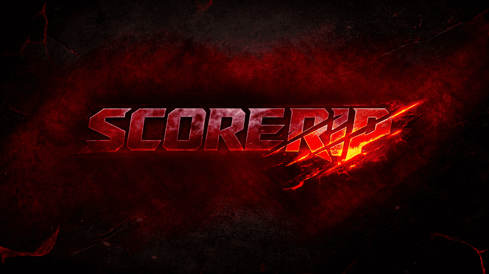
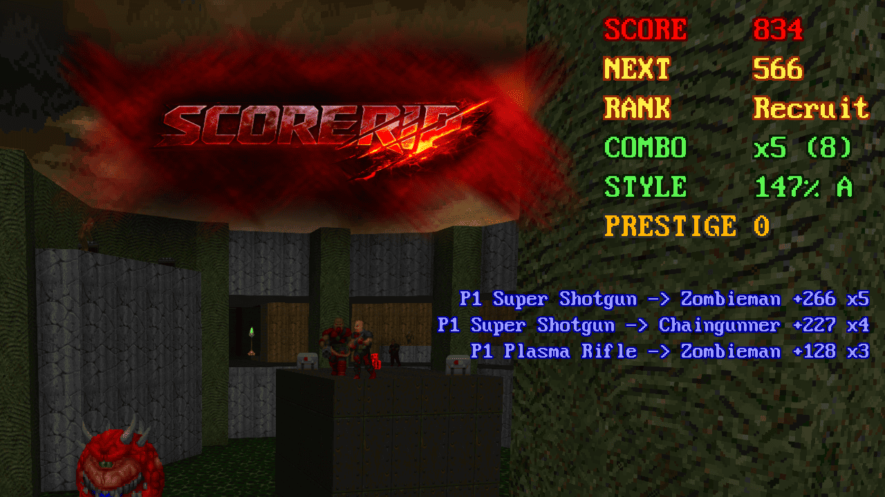

# SCORERIP

## WHAT DOES THIS MOD DO?

EXP Score Mod adds a full arcade-style scoring system to Doom.  
Every monster you kill earns you points, and playing aggressively  
and stylishly earns you bonuses on top of that. Your score carries  
across the entire session, a HUD panel tracks your progress, and  
reaching point milestones rewards you with actual in-game items —  
no pickups needed.

The mod works on top of any WAD and does not touch weapons,  
monsters, or maps. It simply layers a new progression system over  
whatever you're already playing.

## HOW POINTS ARE CALCULATED

### BASE KILL POINTS

Each monster type has a base point value:

- **Zombieman, Shotgun Guy, Chaingunner, SS** — 90  
- **Imp, Demon, Spectre, Lost Soul** — 130  
- **Cacodemon, Hell Knight, Pain Elemental, Arachnotron** — 220  
- **Arch-vile, Baron of Hell, Mancubus, Revenant** — 320  
- **Cyberdemon, Spider Mastermind, any boss** — 700  
- **Unknown / custom monsters (from other mods)** — 100  

### WEAPON MULTIPLIER

The weapon you use when landing the kill affects your final score:

- **Fist (with Berserk)** — +90% (1.9× points)  
- **Fist (no Berserk)** — +65% (1.65× points)  
- **Chainsaw** — +50%  
- **Shotgun** — +20%  
- **Super Shotgun** — +35%  
- **Chaingun** — +10%  
- **Rocket Launcher** — +5%  
- **Pistol** — standard (×1.0)  
- **Plasma Rifle** — −5%  
- **BFG9000** — −15%  

Up-close melee kills are worth more — style matters!

### COMBO

Killing enemies one after another without letting the timer run  
out builds a combo chain. Each extra kill adds +12% to base  
points, up to a maximum of +120%. The HUD shows your current combo  
count and remaining time in seconds.

### STYLE

Style is an extra multiplier based on how impressively you play:

- Close-range kill (melee distance) — +22% bonus  
- 5 kills in a row without taking damage — +25% bonus  
- Switching weapons before the kill — +15% bonus  
- Double kill (2 enemies near-simultaneously) — +10% bonus  
- Triple kill (3 enemies) — +20% bonus  
- Quad kill or more (4+ enemies) — +35% bonus  
- Repeatedly using the same weapon — penalty (starts at  
  the 6th kill in a row, −6% per kill, max −30%)  

Taking damage resets your no-hit kill streak and slightly lowers  
your style multiplier.

On the HUD, style is shown as a percentage and a letter grade:  
**E → D → C → B → A → S → SS → SSS**

### MAP COMPLETION BONUSES

- **Secret found** — +500 points (immediately)  
- **100% kills on the map** — +1200 points at map end  
- **100% secrets on the map** — +900 points at map end  
- **100% items on the map** — +800 points at map end  

## RANKS

Your rank is determined by your total points. There are 80 ranks  
in total, from "Recruit" all the way up to "Transcendent". A sound  
plays every time you rank up.

Rank progression (a sample):  
**Recruit → Scout → Trooper → Hunter → Stalker → Slayer →**  
**Butcher → Reaper → Warlord → Overkiller → Exterminator →**  
**... → Apex Doom → ... → Armageddon → ... → Transcendent**

The full list of all 80 ranks and their required point thresholds  
can be viewed in the in-game Rank Book (accessible from the mod  
options menu).

### PROGRESSION PRESETS

You can choose how fast ranks are earned:  
- **Normal** — standard pace  
- **Fast** — ranks come much sooner, great for casual play  
- **Hardcore** — ranks require far more points, for a real grind  

## PRESTIGE

Once you accumulate enough points to go beyond the maximum rank,  
Prestige kicks in. Your score resets to zero and you start the  
rank ladder over again, but your Prestige counter goes up by 1.  
Think of it as "lapping" the entire progression system. Your  
Prestige count is always visible on the HUD.

## POINT REWARDS

As your score crosses certain milestones, the game automatically  
gives you items — no pickup required. There are 12 fixed tiers,  
after which a repeating 4-tier cycle kicks in indefinitely.

Reward tiers (approximate point thresholds):

- **Tier 1** (~600 pts) — 2 Stimpacks + 20 Bullets  
- **Tier 2** (~1400) — Medikit + 12 Shells  
- **Tier 3** (~2600) — Green Armor + Ammo Clip Box  
- **Tier 4** (~4200) — Shell Box + 10 Armor Bonuses  
- **Tier 5** (~6200) — 4 Rockets + 40 Energy Cells  
- **Tier 6** (~8600) — Backpack + Medikit  
- **Tier 7** (~11500) — Blue Armor + Rocket Box  
- **Tier 8** (~14900) — Cell Pack + Shell Box  
- **Tier 9** (~18800) — Soulsphere + 6 Rockets  
- **Tier 10** (~23200) — Megasphere + Cell Pack  
- **Tier 11** (~28100) — Invulnerability Sphere + Rocket Box  
- **Tier 12** (~33500) — Soulsphere + Megasphere + Cell Pack  

Then cycles: Berserk + Blue Armor, Invulnerability, and more.

## HUD

A small panel is always visible in the corner of your screen.  
Each line can be turned on or off individually:

- **SCORE** — your current total score  
- **NEXT** — how many points until the next reward  
- **RANK** — your current rank name  
- **COMBO** — active combo (e.g. x4 (3) = combo ×4, 3 sec left)  
- **STYLE** — current style as a percentage and grade (A, S, SSS…)  
- **PRESTIGE** — how many times you have prestiged  

There is also a **KILL FEED** — entries that appear on screen for each  
kill, showing the weapon used, the enemy name, and points earned.  
For example: "P1 Shotgun -> Imp +156 x3"

## END-OF-MAP SUMMARY SCREEN

After finishing a level, an extra panel appears on the intermission  
screen showing:

- **GAIN** — how many points you earned on this map  
- **SCORE** — your total score  
- **BEST COMBO** — your highest combo on this map  
- **RANK** — your current rank  
- **PRESTIGE** — your current prestige level  
- **NEW RECORD!** — shown if you beat your previous best on this map  

## SOUNDS

The mod plays audio cues for the following events (each can be  
turned on or off separately):

- Ranking up  
- Setting a new record on a map  
- Reaching 100% kills on a map  
- Reaching 100% items on a map  
- Reaching 100% secrets on a map  

## MOD OPTIONS

All settings are found in:  
**Options → Score Mod Options**

Settings are organized into groups:

### PROGRESSION
- Rank Progression — Normal / Fast / Hardcore  
- Per Secret Bonus — points per secret found (0–1500)  
- 100% Kills Bonus — bonus for full kills on a map (0–3000)  
- 100% Secrets Bonus — bonus for all secrets on a map (0–3000)  
- 100% Items Bonus — bonus for all items on a map (0–3000)  

### STYLE
- Close Range Distance — how close counts as "close range" (0–512)  
- Close Range Bonus (%) — bonus for close-range kills  
- No-Hit Kills Req — kills in a row without damage needed  
  for the no-hit bonus (1–20)  
- No-Hit Bonus (%) — size of that bonus  
- Weapon Swap Bonus (%) — bonus for switching weapons before a kill  
- Repeat Penalty Starts — after how many same-weapon kills in a row  
  the penalty begins (2–20)  
- Repeat Penalty Step (%) — how much the penalty grows each time  
- Repeat Penalty Max (%) — ceiling on the repeat penalty  
- Multi-Kill Window — how quickly enemies must die to count as  
  a multi-kill (in game ticks)  
- Multi-Kill ×2/×3/×4+ — style bonus for each multi-kill tier  

### GLOBAL UI
- Use Global UI Corner — single corner setting for all panels  
- Global UI Corner — Top Left / Top Right /  
  Bottom Left / Bottom Right  

### SCORE HUD
- Show Score HUD — toggle the entire HUD panel on/off  
- Show NEXT line — toggle the "next reward" line  
- Show Rank line — toggle the rank line  
- Show Combo line — toggle the combo line  
- Show Style line — toggle the style line  
- Show Prestige line — toggle the prestige line  
- Color per line — Gold / Green / Red / Light Blue / White /  
  Yellow / Blue / Orange / Gray / Tan / Brick  
- HUD Font Size — Small / Medium / Large  
- HUD Scale (%) — resize the whole panel (50%–300%)  
- HUD X / Y Offset — fine-tune the panel position  
- HUD Line Spacing — gap between lines (8–28)  

### KILL FEED
- Show Kill Feed — toggle on/off  
- Show Weapon In Feed — include the weapon name in each entry  
- Kill Feed Corner — screen position  
- Kill Feed Lines — how many entries to show at once (1–10)  
- Duration (tics) — how long each entry stays on screen  
- Font Size / Scale — visual sizing options  
- Offsets — fine position control  
- Per-line Color — individual color for each of the 10 slots  

### FEEDBACK
- Show Reward Gain — pop-up messages when items are awarded  
- Console Mod Messages — detailed event log in the GZDoom console  
- Show End-Level Panel — toggle the post-map summary screen  

### SOUNDS
- Rank Up Sound — on/off  
- New Record Sound — on/off  
- 100% Kills Sound — on/off  
- 100% Items Sound — on/off  
- 100% Secrets Sound — on/off  

At the bottom of the menu there is a **Reset Score Settings**  
button that restores every setting to its default value.

## COMPATIBILITY

- Works with any WAD (Doom 1, Doom 2, Final Doom, etc.)  
- Compatible with most weapon and monster replacement mods —  
  unknown monsters simply fall back to 100 base points  
- Requires GZDoom 4.10 or newer

